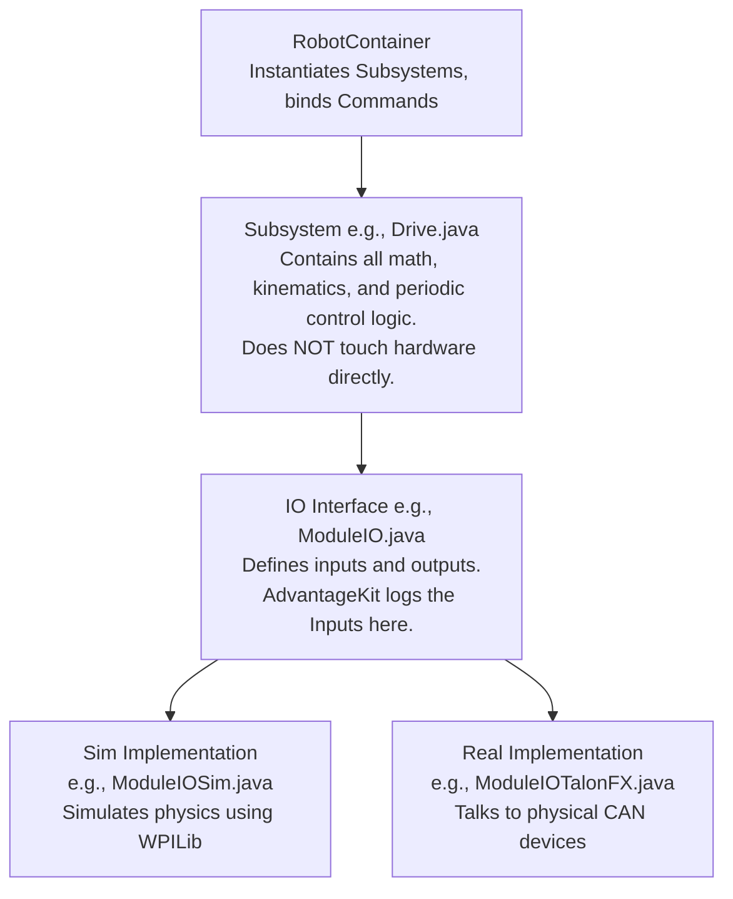

# Documentation Site Implementation Plan

> **For agentic workers:** REQUIRED SUB-SKILL: Use superpowers:subagent-driven-development (recommended) or superpowers:executing-plans to implement this plan task-by-task. Steps use checkbox (`- [ ]`) syntax for tracking.

**Goal:** Set up a static documentation site using MkDocs Material and create the initial beginner-to-advanced content structure.

**Architecture:** Use MkDocs with the Material theme for a fast, searchable static site. Host the source in a `docs_site/` directory (to avoid conflicting with existing `docs/` Markdown files used by the repo), and use GitHub Actions to publish to GitHub Pages.

**Tech Stack:** Python, MkDocs, MkDocs Material theme, GitHub Actions, Markdown.

---

### Task 1: Initialize MkDocs and MkDocs Material

**Files:**
- Create: `mkdocs.yml`
- Create: `docs_site/index.md`

- [ ] **Step 1: Install mkdocs-material locally**
```bash
pip install mkdocs-material
```

- [ ] **Step 2: Create the mkdocs.yml configuration**
```yaml
# mkdocs.yml
site_name: RobotCode2026Public Documentation
theme:
  name: material
  palette:
    primary: deep purple
    accent: deep orange
docs_dir: docs_site
nav:
  - Home: index.md
```

- [ ] **Step 3: Create the initial homepage**
```markdown
# docs_site/index.md
# Welcome to RobotCode2026Public

Welcome to the documentation for 6328's 2026 robot "Darwin". 
This site contains guides for beginners, intermediate concepts, and advanced architecture deep-dives.
```

- [ ] **Step 4: Verify the build works**
Run: `mkdocs build`
Expected: Passes and creates a `site/` directory without errors.

- [ ] **Step 5: Commit**
```bash
git add mkdocs.yml docs_site/index.md
git commit -m "docs: initialize mkdocs material site"
```

---

### Task 2: Set up GitHub Actions Workflow for GitHub Pages

**Files:**
- Create: `.github/workflows/mkdocs-deploy.yml`

- [ ] **Step 1: Create the GitHub Actions workflow file**
```yaml
# .github/workflows/mkdocs-deploy.yml
name: deploy-mkdocs
on:
  push:
    branches:
      - main
permissions:
  contents: write
jobs:
  deploy:
    runs-on: ubuntu-latest
    steps:
      - uses: actions/checkout@v4
      - uses: actions/setup-python@v5
        with:
          python-version: 3.x
      - run: echo "cache_id=$(date --utc '+%V')" >> $GITHUB_ENV 
      - uses: actions/cache@v4
        with:
          key: mkdocs-material-${{ env.cache_id }}
          path: .cache
          restore-keys: |
            mkdocs-material-
      - run: pip install mkdocs-material 
      - run: mkdocs gh-deploy --force
```

- [ ] **Step 2: Commit**
```bash
git add .github/workflows/mkdocs-deploy.yml
git commit -m "ci: add mkdocs deploy workflow"
```

---

### Task 3: Create Documentation Structure and 101 Page

**Files:**
- Modify: `mkdocs.yml`
- Create: `docs_site/101-beginner.md`

- [ ] **Step 1: Update mkdocs.yml navigation**
```yaml
# Replace the nav section in mkdocs.yml
nav:
  - Home: index.md
  - 101 Beginner: 101-beginner.md
```

- [ ] **Step 2: Create the 101 Beginner page**
```markdown
# docs_site/101-beginner.md
# 101: Welcome to FRC Software

This guide introduces Command-Based Programming.

## What is Command-Based Programming?
WPILib's Command-Based framework splits the robot code into **Subsystems** (hardware) and **Commands** (actions).

- **Subsystems:** Represent parts of the robot (e.g., Drive, Launcher). They handle the hardware logic.
- **Commands:** Represent actions (e.g., Shoot, Drive Forward). They use subsystems to do work.
- **RobotContainer:** The glue that binds Commands to Controller buttons.

## Where does the code start?
The robot boots up in `Robot.java`, which instantiates `RobotContainer.java`. Look inside `RobotContainer` to see all the subsystems being created!
```

- [ ] **Step 3: Verify the build**
Run: `mkdocs build`
Expected: Passes.

- [ ] **Step 4: Commit**
```bash
git add mkdocs.yml docs_site/101-beginner.md
git commit -m "docs: add 101 beginner guide"
```

---

### Task 4: Create 201 and 301 Architecture Pages

**Files:**
- Modify: `mkdocs.yml`
- Create: `docs_site/201-intermediate.md`
- Create: `docs_site/301-architecture.md`

- [ ] **Step 1: Update mkdocs.yml navigation**
```yaml
# Add to the nav section in mkdocs.yml
  - 201 Intermediate: 201-intermediate.md
  - 301 Architecture: 301-architecture.md
```

- [ ] **Step 2: Create the 201 Intermediate page**
```markdown
# docs_site/201-intermediate.md
# 201: The AdvantageKit Architecture

Our codebase uses AdvantageKit and the IO pattern.

## The IO Pattern (Hardware Abstraction Layer)
We separate logic from hardware so we can run the code without a physical robot.

Instead of a Subsystem directly importing a `CANSparkMax`, it imports an `IO` interface (e.g., `ModuleIO.java`). 
The IO interface has two implementations:
1. `ModuleIOSim`: Uses WPILib physics classes.
2. `ModuleIOTalonFX`: Talks to physical CAN devices.

AdvantageKit automatically logs all Inputs defined in the IO interface.
```

- [ ] **Step 3: Create the 301 Architecture page**
```markdown
# docs_site/301-architecture.md
# 301: System Design

This is the high-level architecture diagram of the robot code.

## Architecture Diagram



## Key Rules
- **No Hardware in Subsystems:** Subsystems only interact with their `IO` interface.
- **Inputs are Logged:** All sensor data is read into an `AutoLogged` object.
- **Simulation First:** Every subsystem must have a Simulation IO implementation.
```

- [ ] **Step 4: Verify the build**
Run: `mkdocs build`
Expected: Passes.

- [ ] **Step 5: Commit**
```bash
git add mkdocs.yml docs_site/201-intermediate.md docs_site/301-architecture.md
git commit -m "docs: add intermediate and advanced architecture pages"
```

---

### Task 5: Create Cookbook Pages

**Files:**
- Modify: `mkdocs.yml`
- Create: `docs_site/cookbook-subsystem.md`
- Create: `docs_site/cookbook-vision.md`

- [ ] **Step 1: Update mkdocs.yml navigation**
```yaml
# Add Cookbook section to nav in mkdocs.yml
  - Cookbook:
    - Add a Subsystem: cookbook-subsystem.md
    - Implement Vision: cookbook-vision.md
```

- [ ] **Step 2: Create Subsystem Cookbook**
```markdown
# docs_site/cookbook-subsystem.md
# How to Add a New Subsystem

Follow these steps to add a new AdvantageKit-compatible subsystem.

1. **Define the `SubsystemIO` interface:** Create the `Inputs` object and update methods.
2. **Create the `SubsystemIOSim`:** Write the physics simulation.
3. **Create the `SubsystemIOReal`:** Write the actual SparkMax/TalonFX code.
4. **Create the `Subsystem` class:** Handle the logic and math.
5. **Instantiate in `RobotContainer`:** Pass the correct IO implementation based on `Constants.Mode`.
```

- [ ] **Step 3: Create Vision Cookbook**
```markdown
# docs_site/cookbook-vision.md
# How to Implement Vision Detection

Follow these steps to integrate Northstar and AprilTags.

1. **Understand Northstar:** Review the Northstar architecture.
2. **Configure `VisionIO`:** Set up camera parameters.
3. **Process Vision Data:** Use the `Vision` subsystem to estimate pose.
4. **Fuse with Odometry:** Send vision estimates to the `Drive` subsystem.
```

- [ ] **Step 4: Verify the build**
Run: `mkdocs build`
Expected: Passes.

- [ ] **Step 5: Commit**
```bash
git add mkdocs.yml docs_site/cookbook-subsystem.md docs_site/cookbook-vision.md
git commit -m "docs: add cookbook guides"
```
