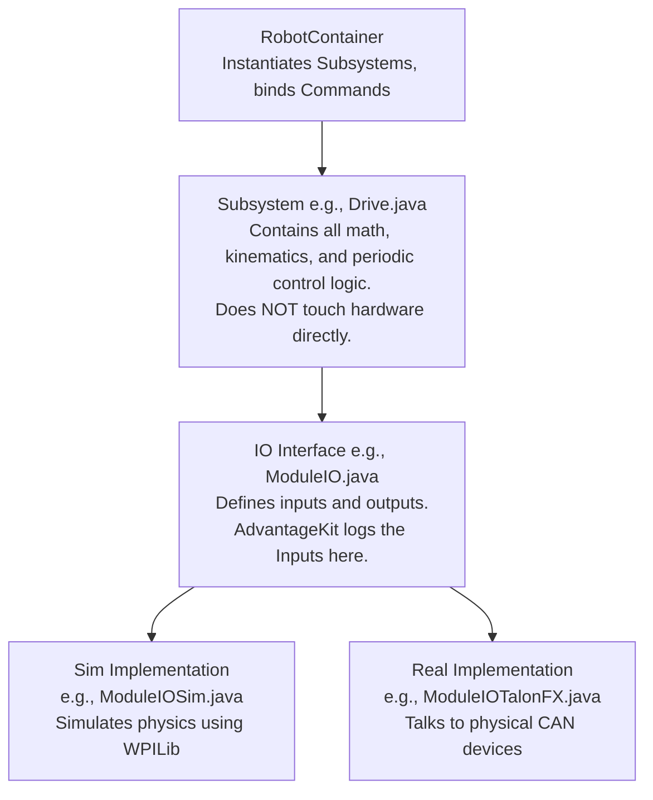

# Documentation Strategy & Architecture Design
**Date:** 2026-04-15
**Topic:** RobotCode2026Public Documentation (Beginner to Advanced)

## Overview
The goal of this project is to create comprehensive documentation for the RobotCode2026Public repository. The documentation must cater to three skill levels:
1.  **Beginner:** Understanding basic concepts (Subsystems, Commands).
2.  **Intermediate:** Reading/writing code, adding simple commands, and understanding the IO layer.
3.  **Advanced:** Grasping the overall architecture, complex logic, and adding advanced features like Vision Detection.

The documentation will be hosted using a **Static Site Generator** (e.g., MkDocs or Docusaurus) to provide a professional, searchable, and easily navigable experience.

## Content Structure (Hybrid Approach)

The documentation will use a "Hybrid" structure, combining a progressive learning path with a task-based cookbook.

### Part 1: Core Concepts (The Learning Path)
This section is designed to take a student from zero knowledge to understanding the entire robot's architecture.

1.  **Beginner (101): Welcome to FRC Software**
    *   What is Command-Based Programming? (Subsystems, Commands, RobotContainer).
    *   How to read a basic subsystem file.
    *   Where does the code start? (Robot.java).
2.  **Intermediate (201): The AdvantageKit Architecture**
    *   Introduction to AdvantageKit and Replay.
    *   **The IO Pattern (Hardware Abstraction Layer):** Why we separate logic from hardware.
    *   Writing basic commands and mapping them to controller buttons.
3.  **Advanced (301): System Design**
    *   Understanding the full architecture diagram (see below).
    *   Writing autonomous routines using Choreo/PathPlanner.
    *   Advanced control loops (PID, Feedforward).

### Part 2: The Cookbook (Step-by-Step Guides)
Task-oriented guides for common software team tasks.

1.  **How to Add a New Subsystem**
    *   Step 1: Define the `SubsystemIO` interface (Inputs and update methods).
    *   Step 2: Create the `SubsystemIOSim` (Physics simulation).
    *   Step 3: Create the `SubsystemIOReal` (SparkMax/TalonFX implementation).
    *   Step 4: Create the `Subsystem` class (Logic and math).
    *   Step 5: Instantiate in `RobotContainer` and handle `Constants.Mode`.
2.  **How to Implement Vision Detection**
    *   Step 1: Understanding Northstar and AprilTags.
    *   Step 2: The `VisionIO` interface and camera configuration.
    *   Step 3: Processing vision data (Pose Estimation) in the `Vision` subsystem.
    *   Step 4: Fusing vision data with Odometry in the `Drive` subsystem.

## Overall Architecture Definition

The codebase heavily utilizes the **AdvantageKit IO Layer Pattern**. The documentation will explicitly define this architecture to ensure advanced students can modify and extend the robot safely.

### Architecture Diagram

**Key Architectural Rules:**
*   **No Hardware in Subsystems:** A Subsystem class should never import a `CANSparkMax` or `TalonFX`. It only interacts with its `IO` interface.
*   **Inputs are Logged:** All sensor data and motor states must be read into an `AutoLogged` inputs object in the IO interface.
*   **Simulation First:** Every subsystem must have a functioning Simulation IO implementation to allow for offline testing and replay.

## Next Steps
1.  Initialize the Static Site Generator (e.g., MkDocs) in the repository.
2.  Set up the GitHub Action to publish the site to GitHub Pages.
3.  Begin drafting the "Beginner (101)" content pages based on the defined structure.
