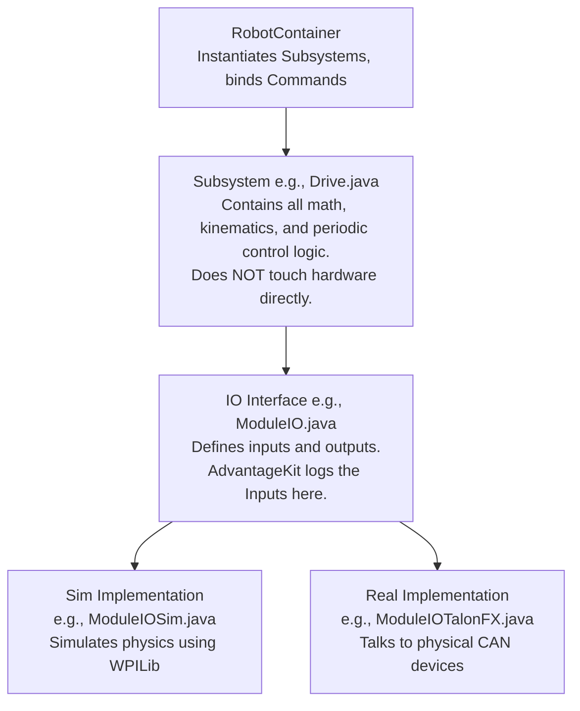

# 301: System Design

This is the high-level architecture diagram of the robot code.

## Architecture Diagram

## Key Rules
- **No Hardware in Subsystems:** Subsystems only interact with their `IO` interface.
- **Inputs are Logged:** All sensor data is read into an `AutoLogged` object.
- **Simulation First:** Every subsystem must have a Simulation IO implementation.
